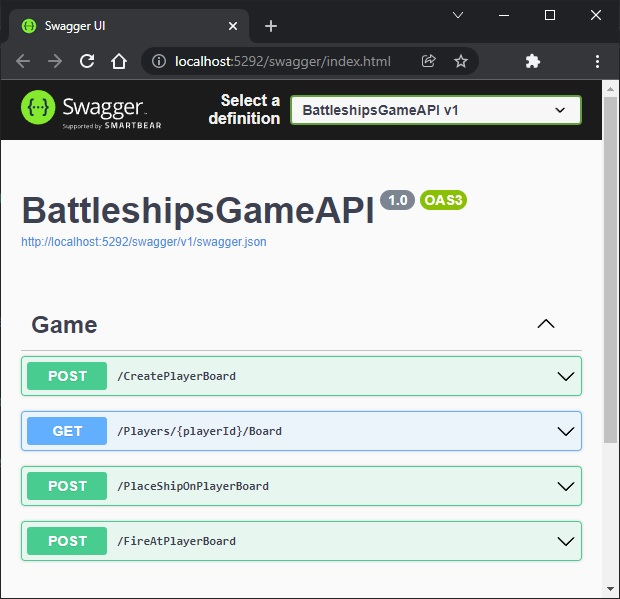
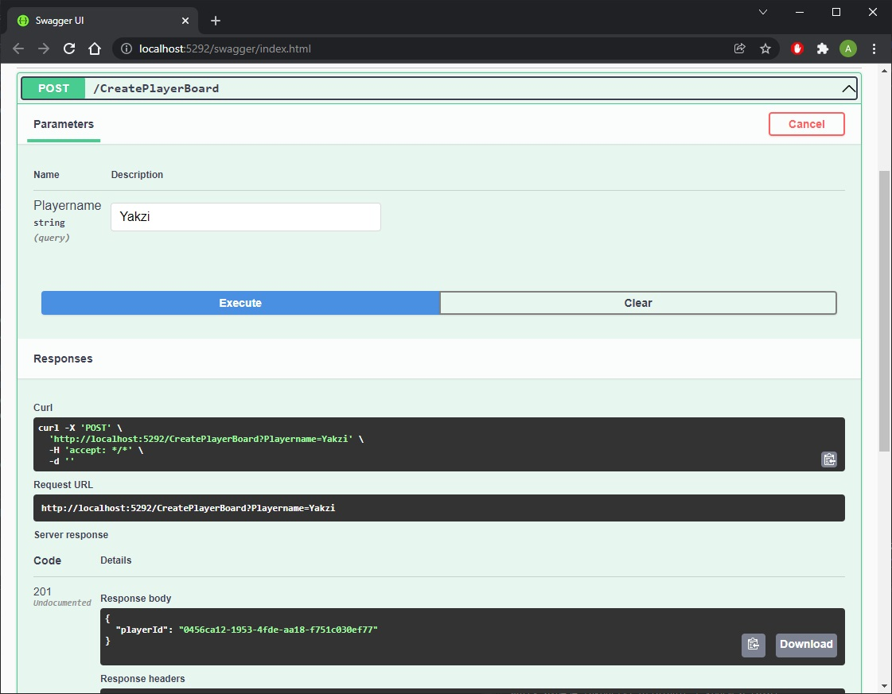
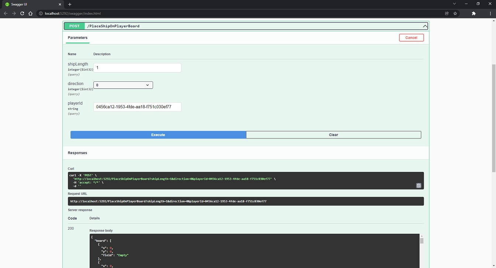

<h1 align="center">
 BattleshipsGameAPI
</h1>

## Table of contents
* [Introduction](#introduction)
* [Endpoints](#Endpoints)
* [Features](#Features)
* [Technologies](#technologies)
* [Screenshots](#screenshots)

## Introduction
<h3>Update 13.01.2022 - Project was almost completely rewritten to suit Repository Pattern and RESTful API - services, repositories, etc.</h3>
ASP.NET Core Web API which allows to simulate battleships game between two AI

## Features
* Create players, insert ships, shoot ships
* Watch every move of AI
* Write/Read everything into/from .json file

## Endpoints
* <b>/CreatePlayerBoard</b> - allows to create a new player with empty board, and saves it (board) to .json file.   <b>Response:</b> New player's GUID
* <b>/Players/{playerId}/Board</b> - allows to recieve player board in a response body
* <b>/PlaceShipOnPlayerBoard</b> - allows to insert a new ship with specified length and direction to player's board, and saves updated board to .json file.  <b> Response: Updated players board in response body</b>
* <b>/FireAtPlayerBoard</b> - allows to shoot other player's board in totally random way (but 'AI' remembers previous missfires and hit ships), and saves updated board to .json file.   <b>Response:</b> Updated players board in response body 
 <b>This funcionality is under development - it works, but there is no condition or any response either than empty list when every ship was hit</b>

## Technologies
* ASP.NET Core Web API
* Json.NET
* Swagger

## Screenshots

 
 
 

